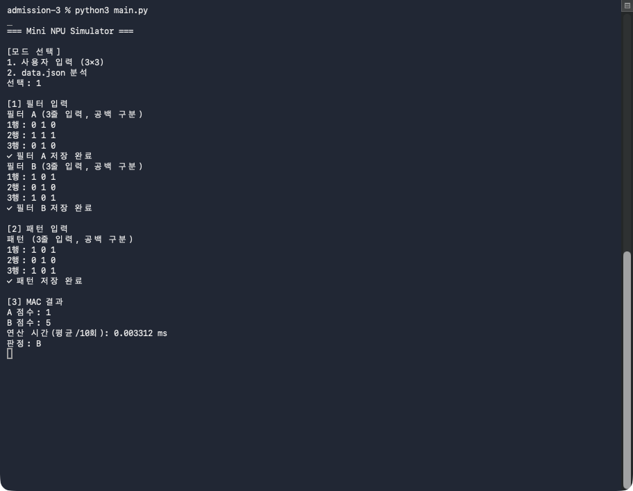
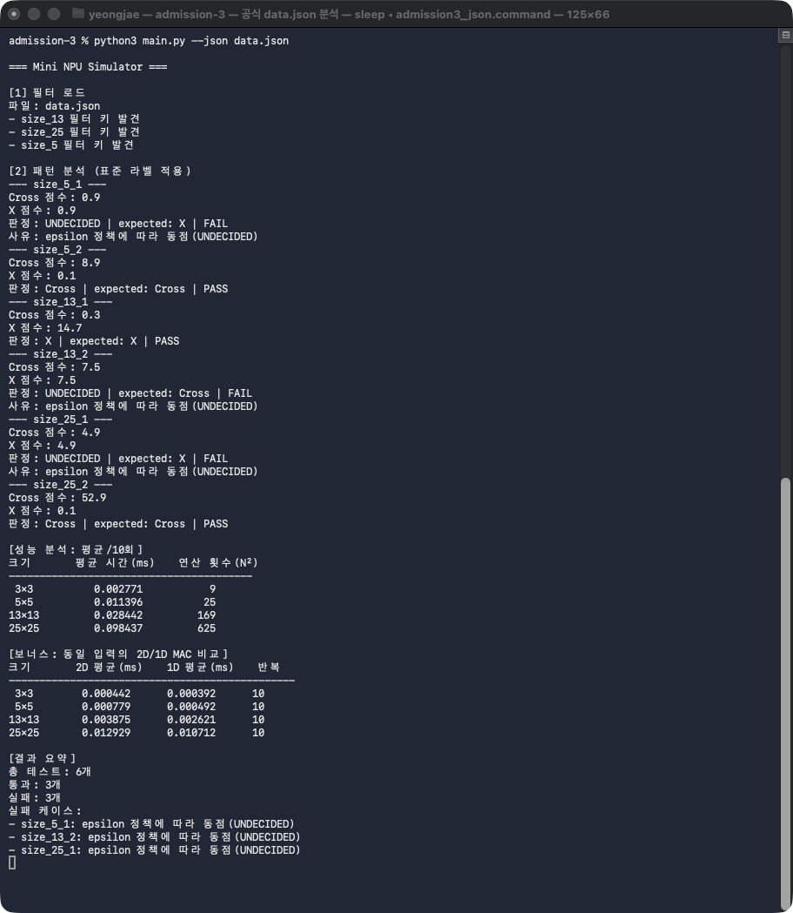
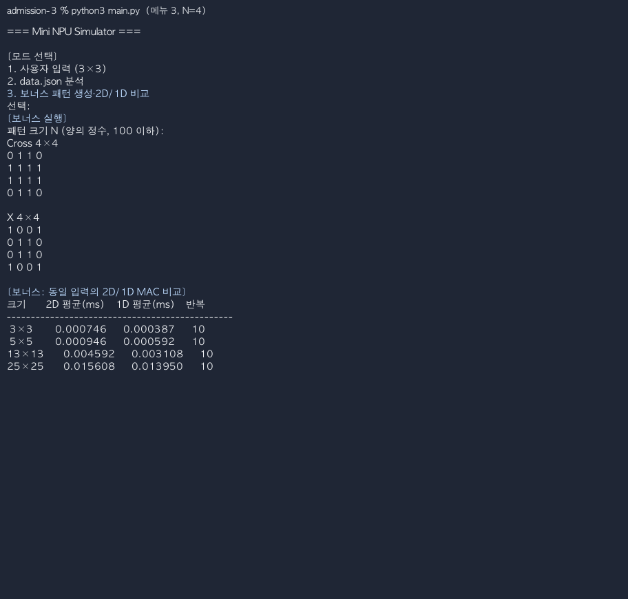

# AI가 계산하는 방식을 흉내 내는 작은 계산기 만들기

[](https://github.com/whiskeyonmytongue/admission-3/actions/workflows/verify.yml)

외부 라이브러리 없이 반복문으로 MAC(Multiply–Accumulate) 연산을 구현한
Python 콘솔 프로그램입니다. 가운데 행과 열이 이어진 Cross 패턴과 두 대각선이
교차하는 X 패턴을 점수로 비교합니다. 3×3 행렬을 직접 입력하거나
`data.json`을 한꺼번에 분석할 수 있으며, 문제가 있는 케이스는 따로 실패
처리하고 나머지 분석을 이어갑니다.

## 바로 실행하기

Python 3.8 이상만 준비하면 됩니다. NumPy나 pandas 같은 외부 패키지는
필요하지 않습니다.

```bash
git clone https://github.com/whiskeyonmytongue/admission-3.git
cd admission-3
python3 main.py
```

프로그램을 실행한 뒤 원하는 방식을 고릅니다.

```text
1. 사용자 입력 (3×3)
2. data.json 분석
3. 보너스 패턴 생성·2D/1D 비교
```

저장된 JSON 6개 케이스는 아래 명령으로 바로 분석합니다.

```bash
python3 main.py --json data.json
```

프로그램은 Python 3.8 이상에서 실행할 수 있습니다. 제출 검증은 GitHub Actions의
Python 3.8 job에서 항상 실행합니다.

```bash
python3.8 main.py --json data.json
```

Python 3.8이 없다면 GitHub Actions의 Python 3.8 검증 결과를 확인할 수
있습니다. 최신 호환성은 Python 3.14에서 별도로 검사합니다. 원격 검증까지
실행하려면 GitHub CLI(`gh`)와 인증된 GitHub 계정도 필요합니다.

## 구현 결과

| 항목 | 결과 | 확인 방법 |
|---|---:|---|
| 수동 3×3 판정 | PASS | `python3 main.py` |
| 제공 JSON 판정 | 3 PASS·3 예상 동점 FAIL | `python3 main.py --json data.json` |
| 3·5·13·25 성능 측정 | 각 10회 평균 | JSON 실행 결과의 성능 표 |
| 1D 메모리 접근 비교 | 완료 | `python3 main.py` → 메뉴 `3` |
| 짝수·홀수 N 패턴 생성 | 완료 | `python3 main.py` → 메뉴 `3` |
| 자동 테스트 | 81개 PASS | GitHub Actions `verify` workflow |
| Python 3.8·3.14 실행 | 각각 81개 PASS | 공식 Python 컨테이너 |
| Python 스타일 | PASS | `python3.8 scripts/check_style.py` |

## 데이터 구성

[data.json](data.json)은 과제에서 제공한 `version: 1.0`, `type: json` 데이터입니다.
5×5·13×13·25×25 필터와 크기별 패턴 2개씩, 모두 6개 케이스가 들어 있습니다.
`scripts/check_data.py`는 필터·패턴 키, 예상 판정 결과와 내용 해시를 함께 검사해
파일이 의도치 않게 바뀌는 것을 막습니다.

## 동작 원리

MAC은 같은 위치에 놓인 두 값을 곱한 뒤 결과를 모두 더해 하나의 점수로 만드는
연산입니다. N×N 입력의 모든 좌표를 한 번씩 방문하므로 곱셈은 정확히 N²번
일어납니다. [npu.py](npu.py)의 `mac_nested()`가 두 겹의 `for` 문으로 이
과정을 구현합니다.

이 과제의 필터와 패턴은 0과 1을 사용합니다. 패턴과 필터가 같은 위치에서
함께 1이면 그 자리의 곱이 점수에 더해집니다. 따라서 같은 모양이 많이
겹칠수록 MAC 점수가 커지고, 두 필터 중 점수가 높은 필터를 더 유사한 필터로
판단합니다. 점수가 같으면 동점 정책을 적용합니다.

```text
패턴 키에서 N 추출
  → size_N 필터 선택
  → N×N 행렬 검증
  → Cross/X 라벨 정규화
  → 두 필터의 MAC 점수 계산
  → epsilon 기준 비교
  → PASS/FAIL 집계
```

JSON 데이터는 아래 순서로 분석합니다.

1. `size_{N}_{idx}` 형식의 패턴 키에서 N을 읽습니다.
2. 같은 크기의 `filters.size_N`을 찾습니다.
3. 필터와 패턴이 N×N 정사각형이며 유한한 숫자로 구성됐는지 확인합니다.
4. 필터 키 `cross`, `x`와 예상값 `+`, `x`를 `Cross`, `X`로 정규화합니다.
5. 패턴과 두 필터의 MAC 점수를 각각 구합니다.
6. 점수 차이가 `1e-9`보다 작으면 `UNDECIDED`로 판정합니다.
7. 판정과 예상 라벨을 비교해 PASS/FAIL을 집계합니다.

`normalize_label()`을 별도 함수로 분리한 이유는 입력 표기를 표준 라벨로
바꾸는 규칙을 한곳에 모으기 위해서입니다. 필터 키와 `expected` 값이 다른
표기를 사용해도 `Cross`와 `X`만 비교하므로 판정 로직이 입력 형식에 오염되지
않습니다. 새 라벨을 추가할 때도 이 함수와 관련 테스트를 확장하면 되어
중복 구현을 줄일 수 있습니다.

동점 경계는 **`abs(Cross-X) < 1e-9`**입니다. 차이가 정확히 `1e-9`이면
동점으로 보지 않습니다. NaN, 무한대, 계산 중 overflow, `bool`, 찌그러진
행렬과 알 수 없는 라벨은 오류로 처리합니다. 빈 `patterns` 역시 성공으로
넘기지 않습니다.

Python의 `float`는 모든 실수를 정확히 표현하지 못하고, 여러 값을 누적하는
과정에서 반올림 오차가 생깁니다. 실제로 같은 값도 계산 순서에 따라 아주
작은 차이가 남을 수 있으므로, 완전히 같은지 비교하면 동점을 놓칠 수
있습니다. 이 과제에서는 이런 차이를 허용하는 기준으로 `epsilon`을 둡니다.

## 실제 실행 결과

### 수동 3×3 판정

Cross 모양을 필터 A, X 모양을 필터 B로 입력한 뒤 X 패턴을 판정했습니다.
B 점수가 5로 A 점수 1보다 높아 `B`로 판정됩니다.



### 제공 JSON 일괄 분석

아래 화면은 `python3 main.py --json data.json`을 실제로 실행한 결과입니다.
6개 케이스의 판정, N² 연산 횟수와 최종 집계를 확인할 수 있습니다.



실행 결과는 6개 중 3개 PASS, 3개 예상 동점 FAIL입니다. FAIL은
분석 오류가 아니라 Cross와 X의 점수가 같을 때 `UNDECIDED`로 판정하는
정책을 적용한 결과입니다. 기대 라벨은 Cross 또는 X이므로 FAIL로
집계되며, JSON 실행 명령도 종료 코드 `1`을 반환합니다.

아래 수치는 별도의 Python 3.8 컨테이너에서 MAC 함수 호출 구간만
10회 측정한 평균입니다. 파일 읽기와 화면 출력 시간은 제외했으며,
터미널 사진의 수치는 촬영 환경이 달라 아래 표와 차이가 납니다.

| 크기 | 평균 시간(ms) | 연산 횟수(N²) |
|---:|---:|---:|
| 3×3 | 0.004488 | 9 |
| 5×5 | 0.010208 | 25 |
| 13×13 | 0.059192 | 169 |
| 25×25 | 0.211747 | 625 |

2D/1D MAC 비교는 모드 2에 섞지 않고 메뉴 3의 보너스 경로에서만 출력합니다.

### 보너스 메뉴 실행 화면

메뉴에서 3번을 선택하고 짝수인 N=4를 입력한 실제 터미널 화면입니다. 가운데
두 행·두 열을 사용하는 2칸 폭 Cross와 두 대각선 X가 출력됩니다.



### 실제 모드 실행 영상

[필수 모드 영상 보기](docs/evidence/videos/mandatory-modes.mp4) ·
[보너스 영상 보기](docs/evidence/videos/bonus-mode.mp4)

두 영상 모두 제출 프로그램을 실제로 다시 실행한 터미널 출력으로 만들었습니다.
개인 경로는 화면에서 `data.json`으로 줄여 표시했습니다. 필수 영상과 보너스
영상을 나눠서 보면 평가 대상 기능과 추가 기능을 구분해 확인할 수 있습니다.

| 장면 | 실제 실행 | 화면에서 확인할 내용 |
|---|---|---|
| 필수: 모드 1 | `python3 main.py` 후 메뉴에서 `1` | 3×3 필터 A/B와 패턴 입력 → MAC 점수 → B 판정 |
| 필수: 모드 2 | `python3 main.py` 후 메뉴에서 `2` | `size_N` 연결 → 6개 케이스별 판정 → 성능 표 → 집계 |
| 보너스 | `python3 main.py` 후 메뉴 `3`, N에 `5` 입력 | 5×5 Cross/X 생성과 2D·1D 평균 시간 비교 |

영상 결과를 다시 만들려면 개발용 도구인 Pillow와 ffmpeg가 필요합니다.
프로그램 자체는 여전히 외부 Python 패키지 없이 실행됩니다.

```bash
python3 scripts/render_demo_video.py
```

측정값은 2026-08-09 Python 3.8 컨테이너에서 얻었습니다. 실행 시간은 CPU
상태에 따라 달라집니다.

### CPU 직렬 실행과 NPU 병렬 실행의 병목

이 프로그램의 `mac_nested()`는 실제 NPU를 사용하지 않습니다. Python으로
NPU의 MAC 연산을 흉내 낸 CPU 단일 스레드 구현입니다. CPU에서는 이중
반복문이 행렬 원소를 하나씩 읽어 `score += pattern × filter`를 차례로
실행합니다. 각 연산이 앞에서 계산한 누적값을 이어받으므로 Python 반복문과
인터프리터 처리, 원소를 읽는 메모리 접근이 주요 병목입니다.

실제 NPU는 여러 MAC 연산기를 배열로 배치해 서로 독립적인 원소 곱을 동시에
처리할 수 있습니다. 이때 병목은 개별 곱셈의 직렬 실행보다 입력과 가중치를
연산기로 공급하는 메모리 대역폭과 데이터 이동, 작업을 연산기 수에 맞게
나누는 타일링, 부분합을 합치는 동기화로 옮겨갑니다. 행렬이 작거나 연산기에
데이터를 충분히 공급하지 못하면 병렬 연산기가 놀게 되어 NPU의 장점을 모두
활용하지 못합니다.

예를 들어 25×25 패턴 하나를 Cross와 X 두 필터로 비교하면 필터마다 625회,
총 1,250회의 MAC이 필요합니다. 이 구현은 1,250회를 Python 루프에서 순서대로
처리하지만 NPU는 독립적인 곱셈을 여러 연산기에 나눠 병렬로 처리한 뒤
부분합을 모을 수 있습니다. 다만 1,250개 값을 연산기로 옮기는 시간과 부분합
결합은 그대로 남습니다. 위 성능 표는 CPU 직렬 구현에서 N² 연산량이 늘어나는
모습을 보여 줄 뿐, 실제 NPU와의 속도 차이를 측정한 결과는 아닙니다.

## 결과 분석

### 판정 결과

- 필터 키 `cross`와 예상값 `+`는 `Cross`로, `x`는 `X`로 정규화했습니다.
- `size_5_1`, `size_13_2`, `size_25_1`은 두 점수가 각각 `0.9`, `7.5`,
  `4.9`로 같아 `UNDECIDED`가 됐습니다. 예상 라벨은 차례로 `X`, `Cross`,
  `X`입니다.
- 나머지 세 케이스의 점수 차이는 `8.8`, `14.4`, `52.8`이어서 예상
  라벨과 같은 결과가 나왔습니다.

### 비교와 오류 처리

- 두 점수의 차이가 `1e-9`보다 작을 때만 `UNDECIDED`로 판정하며,
  epsilon과 정확히 같으면 동점으로 보지 않습니다.
- 잘못된 크기나 라벨은 해당 케이스만 FAIL로 기록해 다음 분석을
  이어갑니다. 메시지는 데이터·스키마 오류, 수치 비교, 판정 불일치를
  구분합니다.

Mode 1은 사용자가 바로 이해할 수 있도록 동점을 `판정 불가`로 표시합니다.
Mode 2는 JSON의 expected 라벨과 비교해 전체 결과를 집계해야 하므로 내부
판정값인 `UNDECIDED`를 그대로 출력하고 FAIL로 셉니다. 두 모드 모두 같은
`compare_scores()`를 사용하므로 판정 기준은 같고, 출력 형식만 사용 맥락에
맞게 다릅니다.

### 성능 분석

- N×N MAC의 곱셈 횟수는 9, 25, 169, 625처럼 N²으로 늘어나며,
  실제 측정에서도 25×25가 3×3보다 오래 걸렸습니다.
- 짧은 실행은 운영체제 스케줄링과 Python 인터프리터 오버헤드의 영향을
  받습니다. 따라서 복잡도는 한 번의 측정 비율보다 이중 반복문과 연산
  횟수에서 더 분명하게 확인됩니다.
- 1D 비교는 평탄화를 측정 전에 끝내고 같은 입력과 반복 횟수로
  진행했습니다. 대체로 빨랐지만 작은 입력이므로 항상 빠르다고
  단정할 수는 없습니다.

### 새 라벨을 추가하는 순서

`data.json`에 예를 들어 `o`라는 라벨을 추가한다면 다음 순서로 확장합니다.

1. `npu.py`의 `normalize_label()`에 `o`의 표준 이름과 입력 별칭을 추가합니다.
2. `compare_scores()`의 판정 라벨, `main.py`의 출력, `simulator.py`의
   expected·필터 검증을 차례로 확인합니다.
3. 기존 `Cross`·`X` 케이스와 새 `O` 케이스를 함께 넣어 정상 판정, 동점,
   잘못된 라벨을 테스트합니다.
4. `data.json` 검증 해시와 실행 결과를 갱신하고 GitHub Actions의 `verify`
   workflow로 전체 회귀 테스트를 실행합니다.

이 순서를 지키면 입력 정규화만 바꾸고 출력이나 집계가 따라오지 않는 부분
변경을 방지할 수 있습니다.

## 보너스 실행

메뉴에서 3번을 고르면 5×5 Cross/X 패턴을 만든 뒤 3·5·13·25 크기의
2D/1D MAC 성능을 같은 반복 횟수로 비교합니다.

```bash
python3 main.py
# 메뉴에서 3 입력
# 패턴 크기 N에 5 입력
```

메뉴 경로에서 크기를 입력받아 검증합니다. 짝수 N은 가운데 두 행과 두 열을
사용해 2칸 폭의 Cross를 만들고, X는 두 대각선을 사용합니다. 안전한 메모리·
출력을 위해 N은 100 이하로 제한합니다. 큰 N을 추가로 지원하려면 아래의
스트리밍·블록화 계획을 적용해야 합니다.

### 큰 N 처리 계획

현재 메뉴 3은 Cross와 X의 N×N 행렬을 메모리에 모두 만든 뒤 모든 행을
출력하고 JSON 분석은 완성된 행렬을 필터별로 따로 순회합니다. 아래 내용은
구현 결과가 아니라 큰 N을 지원할 때 권장하는 개선 순서입니다.

```text
행 또는 블록 읽기 → Cross·X 점수 함께 누적 → 처리한 데이터 폐기 → 요약만 출력
```

1. 스트리밍과 출력 제한

   패턴과 필터를 한 행씩 받아 두 점수에 바로 누적하고 처리한 행은 버립니다.
   입력과 필터까지 행 단위로 공급하면 작업 메모리는 O(N) 수준으로
   줄어듭니다. 기본 화면에는 크기·점수·판정만
   표시하고 전체 행렬은 따로 요청할 때만 출력합니다.

2. 연산 융합

   한 좌표를 읽을 때 Cross와 X 점수를 함께 갱신하고 검증도 한 번만 수행합니다.
   반복 읽기와 복사는 줄지만 필터가 두 개이므로 곱셈은 여전히 2N²회이고
   시간 복잡도도 O(N²)입니다.

3. 타일링과 블록화

   행 단위 처리가 어렵거나 NPU의 로컬 메모리를 쓸 때는 B×B 블록만 올려
   부분합을 누적합니다. 작업 블록은 O(B²)로 제한하고 크기는
   로컬 메모리 용량과 측정 결과에 맞춰 정합니다.

4. 조건부 병렬화

   프로파일링에서 계산이 병목이고 블록이 충분히 클 때만 독립 블록을 나눠
   처리합니다. Python 스레드 대신 프로세스·네이티브 코드·NPU를 검토합니다.
   작은 입력에서는 분배·복사·부분합 결합 비용이 더 클 수
   있기 때문입니다.

지금처럼 JSON 전체를 읽고 리스트로 행렬을 만든 채 MAC 반복문만 스트리밍이나
타일링으로 바꾸면 총 메모리 사용량은 O(N²)로 남습니다. 입력과 필터를 행 또는
블록 단위로 공급하도록 데이터 경로도 함께 바꿔야 합니다.
정확한 MAC을 위해 모든 좌표를 확인하므로 총 연산량 O(N²)은 바뀌지 않으며
병렬 부분합은 덧셈 순서를 바꿀 수 있으므로 epsilon 경계 결과도 다시 검증해야
합니다. 메모리와 출력 병목을 먼저 줄인 뒤, 측정에서 계산이 병목으로 남을
때만 병렬화를 적용합니다.

## 오류 처리

| 상황 | 처리 방식 |
|---|---|
| 메뉴에서 1·2·3 외 입력 | 안내 후 메뉴 재입력 |
| 수동 입력의 열 수·숫자 오류 | 해당 행 재입력 |
| EOF 또는 Ctrl+C | UTF-8 터미널에서 traceback 없이 종료 코드 0 |
| JSON 문법·최상위 스키마 오류 | 원인을 출력하고 종료 코드 1 |
| 패턴 케이스 안의 중복 JSON 키 | 해당 케이스만 FAIL, 다음 케이스 계속 실행 |
| 전역 객체의 중복 JSON 키 | 값을 임의로 고르지 않고 종료 코드 1 |
| JSON 키·경로의 위험 문자 | 제어 문자·Unicode surrogate를 출력 전에 거부 |
| `filters`가 객체가 아님 | `filters는 객체여야 합니다`로 원인 명시 |
| 빈 `patterns` | 처리할 케이스가 없음을 알리고 종료 코드 1 |
| JSON `NaN`·`Infinity`·float overflow·underflow | 오류 또는 해당 케이스 FAIL |
| 패턴 키·라벨·행렬 오류 | 해당 케이스만 FAIL, 다음 케이스 계속 실행 |
| 점수 차이 `< 1e-9` | `UNDECIDED`로 판정 |
| 0 이하·100 초과 패턴 크기 | 오류 안내 후 보너스 크기 재입력 |

의도적으로 손상한 입력까지 검사한 테스트 목록은 아래 명령으로 확인합니다.

```bash
python3.8 -m unittest discover -s tests -v
```

## 자동 검증

GitHub Actions의 `verify` workflow는 Python 3.8과 3.14에서 다음 검사를
자동으로 실행합니다.

```bash
python3 scripts/check_runtime.py
python3 -m scripts.check_syntax
python3 scripts/check_style.py
python3 -m unittest discover -s tests -v
python3 -m scripts.check_data
printf '' | python3 main.py
```

Python 3.8 확인부터 전체 Python 파일의 구문과 스타일 검사, unittest 81개,
공식 데이터의 3 PASS·3 예상 동점 FAIL, EOF 안전 종료까지 차례로 실행됩니다.
보너스 2D/1D 비교 함수도 회귀 테스트에 포함됩니다.
스타일 검사에는 표준 라이브러리만 사용하며 UTF-8·LF·공백·줄 길이·공개 API
docstring·함수 길이와 Python 3.8 문법을 검사합니다.

공식 `python:3.8-slim`과 `python:3.14-slim`에서 같은 81개 테스트를 모두
통과했습니다. GitHub Actions는 Python 3.8 최소 버전과 Python 3.14 호환성을
나눠 검사합니다. 여기에 쓰는 공식 Action은 검토를 마친 커밋 SHA로
고정했습니다.

원격 저장소 상태까지 검사할 때는 아래 명령을 사용합니다.

```bash
python3.8 scripts/verify_remote.py
```

이 명령은 저장소 URL과 PUBLIC 공개 범위, 현재 브랜치 `main`, 깨끗한 작업 트리,
로컬·원격 HEAD 일치를 검사합니다. 실행 전 `gh auth status`가 성공해야 합니다.

## 파일 구성

```text
.
├── main.py                         # 메뉴, 출력, 안전 종료
├── npu.py                          # 행렬 검증, MAC, epsilon, 패턴 생성기
├── simulator.py                    # JSON 케이스 격리와 성능 측정
├── data.json                       # 과제 공식 필터와 패턴 6개
├── tests/                          # 경계·오류·CLI 테스트
├── scripts/check_data.py           # 공식 JSON 구조·해시·예상 결과 검증
├── scripts/check_style.py          # 스타일·docstring·Python 3.8 검사
├── scripts/check_syntax.py         # 전체 Python 파일 구문 검사
├── scripts/verify_remote.py        # PUBLIC/main/HEAD 검증
├── docs/evidence/images/           # 실제 터미널 실행 화면
├── docs/evidence/videos/           # 필수·보너스 실행 영상
├── .github/workflows/verify.yml    # Python 3.8·3.14 CI
```
